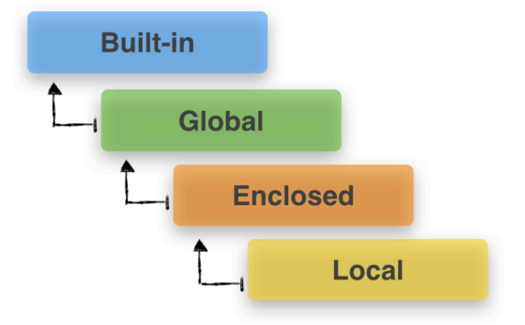

### 函数

#### 函数定义

- 函数是一个用`def`定义的代码块。
- 任何情况下都返回一个值。
- Python中的调用符号：`()`，任何一个变量跟`()`，都会当作函数调用。
- `callable`：用来判断一个函数是否可以调用。
- `return`语句：可省略，可单独出现；可返回多个变量（终止与返回值）
- 放在函数定义开头的字符串称为 **docstring**，作为函数的一部分（`__doc__`)
- 交互式解释器中的使用`help`函数来查询函数的帮助信息，用于开源场景

```python
>>> def print_hello():
... print("hello")
...
>>> print_hello()
hello
>>> help(print_hello)
```

```
Help on function print_hello in module __main__:
print_hello()
(END)
```

```python
>>> def print_hello():
... '''JUST A FUNCTION'''
... print("hello")
...
>>> print_hello()
hello
>>> help(print_hello)
```

```python
Help on function print_hello in module __main__:
print_hello()
	JUST A FUNCTION
(END)
```

```python
>>> print_hello.__doc__
'JUST A FUNCTION'
>>> print_hello.__doc__ = 'just a function'
>>> print_hello.__doc__
'just a function'
>>> help(print_hello)
```

```
Help on function print_hello in module __main__:
print_hello()
	just a function
(END)
```

```python
def fun_1():
    pass
def fun_2():
    return
def fun_3():
    return None
def fun_4():
    return 4
# 将多个返回值当成一个 tuple 返回
def fun_5():
    return 1,2,3,4,"5"
# 显示 5 个函数的输出，eval：将一个字符串当成python命令来执行
[eval('fun_' + str(x) + '()') for x in range(1,6)]
```

```
[None, None, None, 4, (1, 2, 3, 4, '5')]
```

#### 函数参数

- 形参：定义函数是括号中的参数为形参

- 实参：使用函数时传递的参数是实参

#### 参数的传递

实参的传递本质上是赋值。赋值就要看赋值的是可变对象还是不可变对象，把一个变量和它所在地址想象成盒子里的东西和用于标识盒子的标签。可变对象赋值，赋值的是标签；不可变对象，赋的是盒子本身。

如何传递一个可变对象的同时不希望被函数修改呢？

```python
>>> a,b = [1],[1]
>>> sigai(a[:],b[:])
[1, 1] [1, 1]
[1, 1, 1, 1]
>>> print(a,b)
[1] [1]
```

> 注：嵌套 List 要使用 copy.deepcopy

#### 位置参数与关键字参数

位置参数：调用函数时，形参与实参形成一一对应的关系。

遇到函数有多个参数怎么办？调用的时候实在很难纯靠记忆将函数参数一一对应，python中提供了关键字参数，这样在调用时就与参数位置无关了。

```python
>>> def say_hi(say, name):
    	print(say + ' ' + name + '!')
        
>>> say_hi(name='inger',say='hello')
hello inger!
```

关键字参数更重要的用途是 **设置默认值**，在大型程序中尤其重要：

```python
>>> def say_hi(say='hello', name):
    	print(say + ' ' + name + '!')
        
>>> say_hi('inger')
hello inger!
```

- 最好不要同时使用多个位置参数与多个关键字参数；
- 如果使用了关键字参数，位置参数越少越好，并且集中放在最前面。

#### 传递任意数量的参数

```python
# *变量名：传递任意多的参数
def sum(*list):
    result = 0
    for x in list:
        result += x
    return result

sum(1,2,3,4,5)
# 15
```

与赋值不同，函数的参数用 * 拆包或缝合时，得到的是元组：

```python
list(range(7))
# 赋值是得到的是list
a,*b,c = list(range(7))
print(type(b))
# <class 'list'>
# 函数参数得到的是 tuple
def sum(*l):
    print(type(l))
sum(1,2)
# <class 'tuple'>
```

可以使用`**`接受任意个关键字参数，每个关键字的 key 为参数名，value 为参数值：

```python
def register(**kw):
    print('the type of kw is: ', type(kw))
    print('kw: ', kw)
    
register(name = 'inger', PI = 3.1415926)
```

```
the type of kw is:  <class 'dict'>
kw:  {'PI': 3.1415926, 'name': 'inger'}
```

也可以位置参数和关键字参数一起调用：

```python
def register(*list,**dict):
        print(list)
        print(dict)
        
register(1,2,3,name='inger',pi=3.14)
```

```
(1, 2, 3)
{'name': 'inger', 'pi': 3.14}
```

### 命名空间和作用域（Namespace and Scope Resolution）

#### 命名空间

- A namespace is a mapping from names to objects.
- Most namespaces are currently implemented as Python dictionaries.

#### 作用域

- Namespaces can exist independently from each other

- They are structured in a certain hierarchy
- The scope in Python defines the hierarchy level
- in which we search namespaces for certain “name-to-object” mappings
- Scope resolution for variable names via the LEGB rule.

##### 作用域的产生

- Local：function and class method，局部变量（local），比如函数内部；
- Enclosed：its enclosing function, if a function is wrapped inside another function，包含非局部变量（non-local）和非全局变量（non-global），比如嵌套函数外层相对于内层的变量；
- Global：the uppermost level of executing script itself，全局变量（global），位于当前脚本的最外层；
- Built-in：special names that Python reserves for itself，`__builtin__`模块中的变量/关键字等



创建时从上往下创建，访问时从下往上搜索。

- built-in: 解释器在则在，解释器亡则亡；
- global：导入模块时创建，直到解释器退出
- local：函数调用时才创建

##### 变量作用域识别三要素

- 出现位置
- 赋值位置
- 声明类型

##### 3种作用域；5次调用；3次赋值；0次声明

```python
a = 1
print(a)
def func_enclosed():
    a = 2
    print(a)
    def func_local():
        a = 3
        print(a)
    func_local()
    print(a)
func_enclosed()
print(a)
```

```
1
2
3
2
1
```

总结：无声明情况下，赋值即私有，若外部有相同变量名则将其遮挡。

##### 3种作用域；5次调用；1次赋值；0次声明

```python
a = 1
print(a)
def func_enclosed():
    # a = 2
    print(a)
    def func_local():
        # a = 3
        print(a)
    func_local()
    print(a)
func_enclosed()
print(a)
```

```
1
1
1
1
1
```

总结：无赋值情况下，变量访问依据 LEGB 法则

##### 3种作用域；5次调用；3次赋值；1次`global`声明

```python
a = 1
print(a)
def func_enclosed():
    global a
    a = 2
    print(a)
    def func_local():
        a = 3
        print(a)
    func_local()
    print(a)
func_enclosed()
print(a)
```

```python
1
2
3
2
2
```

总结：内层函数可以通过声明的方式直接修改外部变量

```python
a = 1
print(a)
def func_enclosed():
    a = 2
    print(a)
    def func_local():
        global a
        a = 3
        print(a)
    func_local()
    print(a)
func_enclosed()
print(a)
```

```
1
2
3
2
3
```

总结：local 层函数，通过 global 声明，可以越过 non-local 层直接修改全局变量。

##### 3种作用域；5次调用；3次赋值；2次`global`声明

```python
a = 1
print(a)
def func_enclosed():
    global a
    a = 2
    print(a)
    def func_local():
        global a
        a = 3
        print(a)
    func_local()
    print(a)
func_enclosed()
print(a)
```

```
1
2
3
3
3
```

总结：global 声明其实是一种绑定关系，意思是告诉解释器，不用新创建变量了，我用的是全局变量。

##### 3种作用域；5次调用；3次赋值；1次`nonlocal`声明

```python
a = 1
print(a)
def func_enclosed():
    # global a
    a = 2
    print(a)
    def func_local():
        nonlocal a
        a = 3
        print(a)
    func_local()
    print(a)
func_enclosed()
print(a)
```

```
1
2
3
3
1
```

总结：最内层的函数如果想修改中间层的变量而不是全局变量，可以使用 `nonlocal`关键字。

##### 3种作用域；5次调用；3次赋值；1次`global`，1次`nonlocal`声明

```python
a = 1
print(a)
def func_enclosed():
    global a
    a = 2
    print(a)
    def func_local():
        nonlocal a
        a = 3
        print(a)
    func_local()
    print(a)
func_enclosed()
print(a)
```

```
File "<ipython-input-86-4fa9e5aefec1>", line 8
    nonlocal a
SyntaxError: no binding for nonlocal 'a' found
```

总结：最内层使用`nonlocal`只能修改中间层定义的变量，且中间层变量被声明为全局变量后会报错。

> - 无声明情况下，赋值即私有，若外部有相同变量名则将其遮挡；
> - 想修改外部相同变量名，需要将外部变量名声明
>   - 根据外部变量的作用域级别不同，使用 global 或 nonlocal 关键字

#### Python解释器如何识别变量的作用域？

- 先看出现了几层作用域；
- 再看变量出现的位置；
- 如果有队变量进行赋值操作，则再看是否声明为外部变量；

**变量出现的位置 + 变量是否被赋值 + 变量是否被明确声明 => global, nonlocal, local**

### 函数式编程

#### 概述

- 前提：函数在 Python 中是一等对象；
- 工具：built-in 高阶函数；lambda函数；operator模块；functools模块；
- 模式：闭包与装饰器
- 替代：用 **List Comprehension** 可轻松替代 map 和 filter
- 原则：**No Side Effect**

> No Side Effect:  函数的所有功能就仅仅是返回⼀个新的值⽽已，没有其他⾏为，尤其是不得修改外部变量 因⽽，各个独⽴的部分的执⾏顺序可以随意打乱，带来执⾏顺序上的⾃由。
>
> 执⾏顺序的⾃由使得⼀系列新的特性得以实现：⽆锁的并发；惰性求值；编译器级别的性能优化等。

#### 命令式编程与函数式编程

程序的状态首先包含了当前定义的全部变量，有了程序的状态，我们的程序才能不断往前推进。命令式编程就是通过不断修改变量的值，来保存当前运行的状态，基于上一个状态往后步步推进，直到走到最后一个状态。

而函数式编程式通过函数来保存程序的状态（通过函数创建新的参数和返回值来保存状态），**函数一层层的叠加起来**，每个函数的参数或返回值代表了一个中间状态。

命令式编程里一次变量值的修改，在函数式编程里就变成了一个函数的转换。

Python并不是纯粹的函数式编程语言，因为Python中变量定义之后不仅可以更改，甚至类型都可以改变。函数式编程理论上讲，变量值是永远都不可改变的。

#### 一等函数

一等对象：Python中所有的函数都是一等对象，简称为一等函数。

- 在运行时创建：即直接创建函数，无需用 main
- 能赋值给变量或数据结构中的元素
- 能作为参数传递给函数
- 能作为函数的返回结果

```python
#运行时创建
def say():
    print('hello')
say()
# 赋值给变量或数据结构中的元素
test = say
test()
# 作为参数传递给函数
def repeat(f, num):
    [f() for i in range(num)]
repeat(say, 3)
# 作为函数的返回结果
def repeated_func(f,num):
    def new_func():
        [f() for i in range(num)]
    return new_func
repeated = repeated_func(say, 3)
repeated()
```

#### 高阶函数

定义：接受函数为参数，或把函数作为返回结果的函数。

##### map高阶函数：将一个行为映射到可迭代对象

```python
def square(x): return x*x
# 将 square 函数映射到 range(10) 这个迭代器
xx = map(square, range(10))
# xx 其实是一个 map 对象
xx
# <map at 0x7f0550176be0>
# 构造一下
xx = list(xx)
xx
# [0, 1, 4, 9, 16, 25, 36, 49, 64, 81]
```

> 用`[x*x for x in range(10)]`可以轻松实现同样的操作

##### filter高阶函数

```python
x = [(), [], {}, None, '', False, 0, True, 1, 2, -3]
x_result = filter(bool, x)
x_result
# <filter at 0x7f05501bb518>
x_result = list(x_result)
x_result
# [True, 1, 2, -3]
[i for i in x if bool(i)]
# [True, 1, 2, -3]
```

##### reduce高阶函数

```python
def multiply(a, b): return a * b
from functools import reduce
reduce(multiply, range(1,5))
# 24
```

##### sorted: 对所有可迭代对象进行排序操作

```python
>>> sorted([x * (-1) ** x for x in range(10)])
[-9, -7, -5, -3, -1, 0, 2, 4, 6, 8]
>>> sorted([x * (-1) ** x for x in range(10)], reverse=True)
[8, 6, 4, 2, 0, -1, -3, -5, -7, -9]
# key 可传入函数的名称
>>> sorted([x * (-1) ** x for x in range(10)], key=abs)
[0, -1, 2, -3, 4, -5, 6, -7, 8, -9]
>>> sorted([x * (-1) ** x for x in range(10)], reverse=True, key=abs)
[-9, 8, -7, 6, -5, 4, -3, 2, -1, 0]
```

##### partial

返回一个新的局部对象，当调用该对象时，它的行为将与函数调用类似，带有位置参数args和关键字参数关键字。如果为调用提供了更多的参数，它们将被附加到args中。如果提供了额外的关键字参数，它们将扩展和覆盖关键字。

```python
>>> from functools import partial
>>> abs_sorted = partial(sorted, key=abs)
>>> abs_sorted([x * (-1) ** x for x in range(10)])
[0, -1, 2, -3, 4, -5, 6, -7, 8, -9]
>>> abs_reverse_sorted = partial(sorted, key=abs, reverse=True)
>>> abs_reverse_sorted([x * (-1) ** x for x in range(10)])
[-9, 8, -7, 6, -5, 4, -3, 2, -1, 0]
```


#### 匿名函数

- 定义：使用 lambda 表达式创建的函数，函数本身没有名字
- 特点：只能使用纯表达式，不能复制，不能使用while和try等块语句
- 语法：`labmbda [arg1 [, arg2[, arg3...]]]:expression`

##### lambda 与 def 的区别

- 写法上：
  1. def 可以用代码块，一个代码块包含多个语句
  2. lambda 只能用单行表达式，而表达式仅仅是单个语句的一种
- 结果上
  1. def语句一定会增加一个函数名称
  2. lambda 没有函数名称，降低了变量名污染的风险

**能用一个表达式直接放到 `return`里返回的函数都可以用 lambda 速写**。

```python
def multiply(a, b): return a * b
multiply(3,4)

multiply_by_lambda = lambda x,y: x * y
multiply_by_lambda(3,4)
```

##### List + lambda 可以得到行为列表

```python
# 包含3个函数的list
f_list = [lambda x: x+1, lambda x: x**2, lambda x: x ** 3]
[f_list[j](10) for j in range(3)]
# [11, 100, 1000]
```

##### 惰性计算

### 闭包

Python2 中是没有 `nonlocal`关键字的，为什么会出现 `nonlocal` 关键字？

- nonlocal 填补了 global 和 local 之间的空白；
- nonlocal 的出现其实是一种权衡利弊的结果：**私有之安全封装，全局之灵活共享**。

同样这也是闭包出现的原因之一。

闭包：延伸了作用域的函数，能访问 **定义体之外** 定义的 **非全局变量**。

也就是说 对于 local 层的函数，及可以访问全局层面的数据，又可以访问 non-local 层的数据。

#### 小栗子：使用闭包实现 `avg` 函数

```python
def make_averager():
    # 可变对象
    series = []
    def averager(new_value):
        series.append(new_value)
        total = sum(series)
        return total/len(series)
    return averager
avg = make_averager()
avg(10)
# 10
avg(11)
# 10.5
```

闭包是一种函数，它会保留定义函数时存在的外层非全局变量的绑定。

对上面的代码进行内存优化和时间优化来避免重复计算：

```python
def make_averager():
    # 不可变对象
    count = 0
    total = 0
    def averager(new_value):
        # 使用 python3 引进的 nonlocal 变量来修改不可变对象的值
        nonlocal count, total
        count += 1
        total += new_value
        return total/count
    return averager
avg = make_averager()
avg(10)
# 10
avg(11)
# 10.5
```

#### 优点

- 共享变量时避免使用了不安全的全局变量；
- 允许将函数与某些数据关联起来，类似于简化版的面向对象编程；且内存消耗要远远小于面向对象的内存消耗；
- 相同代码每次生成的闭包，其延伸的作用域都彼此独立；
  - 也就是说上栗中，`avg2 = make_averager()`与 avg 是完全独立的数据域；
- 函数的一部分行为在编写时无法预知，需要动态实现，同时又想保持接口一致性；
- 类的生命周期远大于闭包
- 实现装饰器，装饰器中的绝大部分情况都是用闭包来实现的。

### 
