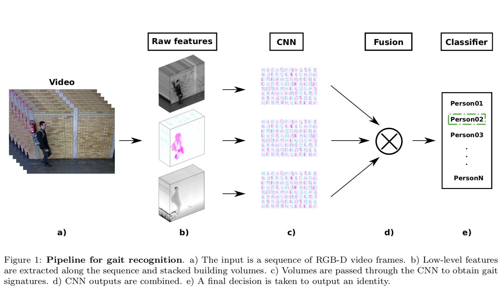
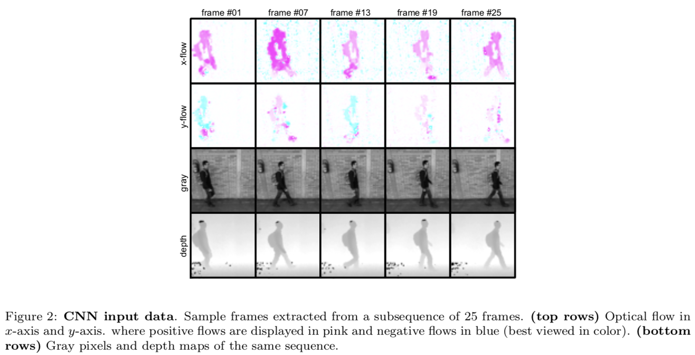
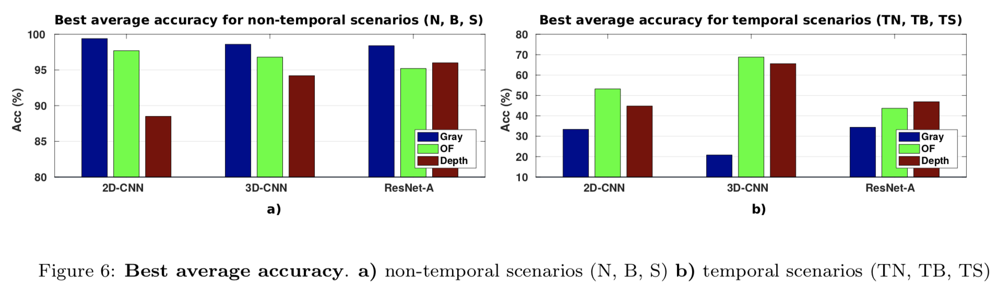
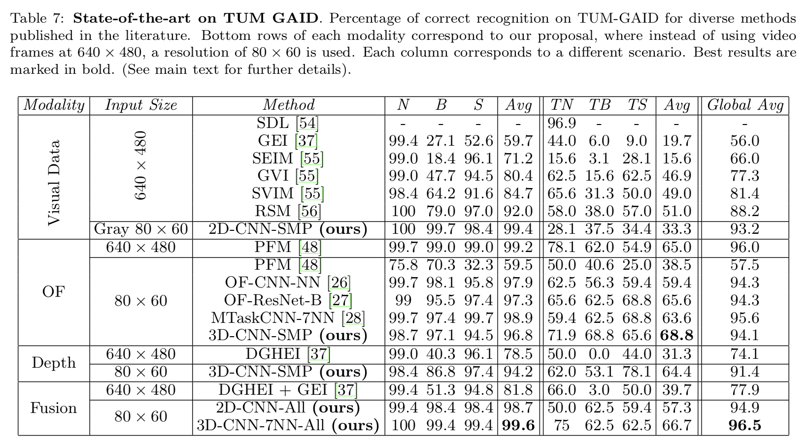
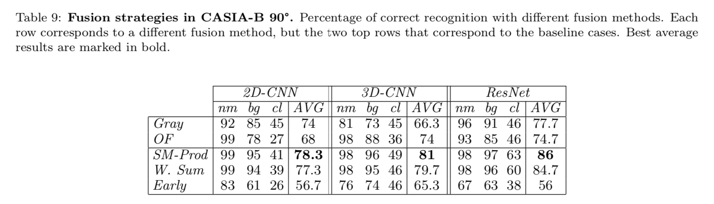
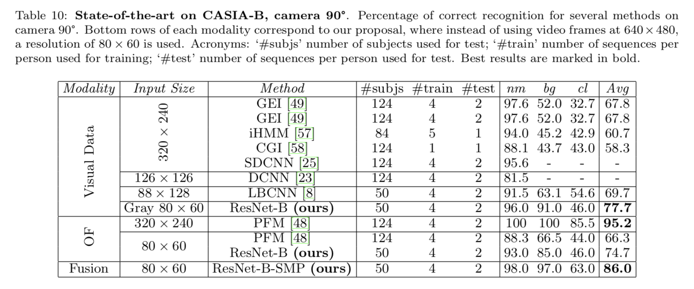

## Multimodal feature fusion for CNN-based gait recognition: an empirical comparison

### 摘要

视频中的步态识别是计算机视觉一个相关任务，当下的主流方法是从图像的二进制序列中输出步态特征，但这伴随着大量的不稳定噪音，从而影响了模型效果。相反的，这篇论文着眼于从图像中分离的原始像素（raw pixels）或简单的函数（function），从而提取出有用的信息。论文在 TUM-GAID 和 CASIA_B 两个数据集上对三个低级特征（即灰色像素，光流通道和深度图）进行了不同卷积神经网络架构的比较研究，并将不同时期的融合方法进行比较研究，用于组合从低级特征中获得的信息。

### 正文

步态识别是人体动作识别的一个特殊分支，但步态识别需要比动作识别更细粒度的特征。

特征学习（feature learning）：让机器从数据集中学习和抽取特征；

信息融合（Information fusion）：不同的描述符可能代表相同的数据，信息融合就是将多个描述符融合为单一的描述符。信息融合传统上分为早期融合（*early fusion*, feature fusion）和晚期融合（*late fusion*, descion fusion）。

从原始视频中提取出三种低级特征，从上往下依次为灰度图、光流通道和深度图，通过CNN获取步态特征，最后经过信息融合输出识别的结果。

- Single modality：原始视频分为长度相同的几个子序列，取几个关键帧 frame 01, 07, 13, 19, 25，对每个子序列提取的特征采取多数表决的策略（*majority voting*）。
  $$
  P(v = c) = \prod_{i=1}^tP_i(s_i = c),\\
  t: \text{the number of the subsequences}\\
  \text{P(v=c): the probability of assigning the identity c to the person in vidio  v}\\
  P_i(s_i = c)\text{: the probability of assigning the identity c to the person in subsequences } s_i
  $$
  

- Multiple modalities：使用 m 个 modalities 测试，综合考虑概率；

  - Products of softmax vectors：

  $$
  S_{prod}(v=c) = \prod_{i=1}^nP_i(m_i=c)\\
  n: \text{the number of modalities used to classify video v}\\
  S_{prod}(v=c) :\text{the probability of assigning the identity c to the person in video v}\\
  P_i(m_i=c):\text{the probability of assigning c to the person in modality }m_i
  $$

  

  - Weighted sum of softmax vectors: 每种方法的结果具有不同的权值

  $$
  S_{WS}(v=c) = \sum_{i=1}^n\beta_iP_i(m_i=c),\ \beta_i >0 \ and \ \sum_{i=1}^n\beta_i = 1
  $$

提取特征的最后一步是在数据集中对应一个人，虽然CNN的softmax层已经是分类器（即每个单元代表属于一类的概率），但是全连接层可以用作支持向量机（SVM）分类器的输入。

#### TUM_GAID数据集的实验结果

上图展示了不同模型特征选择的平均准确率，论文并详细展示了每种模型结构下采用不同的特征融合方法得到的详细数据，总结如下。

- 2D-CNN：最好将所有三种模态结合起来用于所有融合方法 94.9%；除了 SM Prod 最好只使用 OF 和 Gray模态；
- 3D-CNN：最高的平均准确率是W SUM方法融合模式的结果 94.3%，OF, gray, depth 参数分别取 0.4, 0.3, 0.3；
- Res-Net：early fusion 改善了 OF-Gray 的平均准确率达到了 91.9%，表明在训练过程中增加更多的输入可以有利于避免局部最小值。

总之，使用多模态融合的特征融合方法将准确率提高了 0.9%，下图展示了当前对于 TUM-GAID 数据集的识别最高准确率。

#### CASIA_B数据集的实验结果

关于模型结构评估，结果表明，ResNet-B 在每种结果下都能取得最好的结果。这表明如果数据具有足够的可变性，ResNet会更强大。另一方面，3D-CNN对于OF模态获得了非常好的结果，而2D-CNN为 Gray 模态获得了良好的结果。

### 结论

根据输入特征类型的不同，在具有相同视点（viewpoints）的数据集中，由于灰色像素高度依赖于外观，所以表现最差；光流通道正如期望的那样表现的最好；在图片变化很小的情况下，深度图也表现的不错。而在具有多个视点的数据集中，灰色像素得到了最好的结果，可能是因为光流通道根据不同的视点产生了不同的向量，所以在训练时，优化过程无法得到良好的项目多视图表示。

关于架构的类型，2D-CNN在大多数情况下产生更好的结果; 3D-CNN在变化的场景中特别有用; ResNet模型设计得非常深，因此，它们需要大量的样本且样本之间具有高度可变性的数据集才能很好地运行。其中 ResNet-A 产生的结果比TUM-GAID（具有低变异性的数据集）的其他两种体系结构更差，但另一方面，ResNet-B产生了CASIA-B的最佳结果（数据集与高变异性）。

最后，实验结果表明，多种特征的融合大多数情况下都能提高系统的识别准确度，至少它的效果与单一模态所获得的最佳结果一致。

结果表明，最佳模型是3D-CNN和ResNet，如果数据集包含足够的训练数据，后者是最佳选择。关于融合方法，最好选择是后期融合方法，本文的例子中是softmax分数的乘积。未来我们计划深入研究我们早期的融合方法，以解决分支机构中不同收敛速度的问题。

-------

参考资料：

- [特征选择和特征融合](https://www.cnblogs.com/pomodoro/p/9150726.html)

- [softmax讲解](https://blog.csdn.net/bitcarmanlee/article/details/82320853)

- [ReLU and Softmax Activation Functions](https://www.jianshu.com/p/95ea48b21c53)
- [pdf-marked](/assets/pdf/multimodal-feature-fusion-for-cnn-based-gr.pdf)