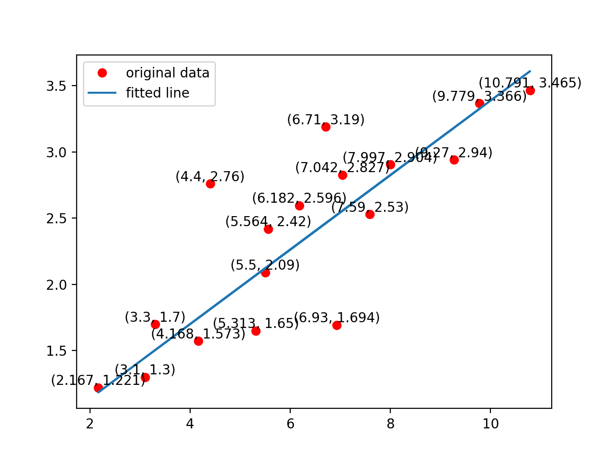
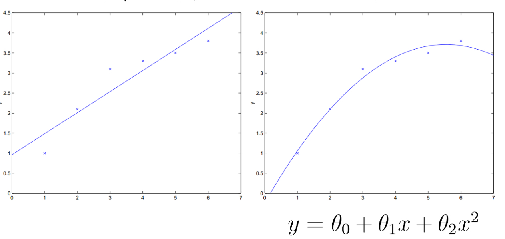
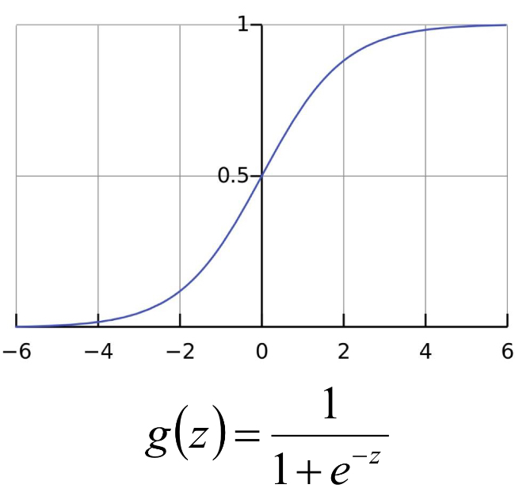

机器学习中的问题主要有两种，一种是分类，一种是回归。分类很好理解，就是对不同的目标在所给的几个类别中判断属于哪一类或多类，即解决离散数据的预测问题。

Regression 最早是由达尔文的表哥高尔顿在研究人类进化规律时发现父子的身高出现一种儿子会越来越高，直到某一代达到峰值下一代身高又会慢慢变低，也就是说**所有的表现都会回归到一个平均值**，称其为回归平均值现象，而回归就是对这些连续数据基于平均值进行预测。

机器学习本质上是使用相当大的数据去解决很小的任务，让机器把一堆数据按某种规则进行识别，最后得到想要的结果。问题越复杂，给数据寻找恰当模型的可能性就越低，机器需要的运算时间就更长，本文介绍机器学习中的一些基本模型，在文章最后附代码实现。

### 线性回归（Linear Regression）

线性回归就是找到一条所有数据的最佳拟合线，称之为回归线，从而通过 X 的值去预测 Y 的结果。当  X 只有一个变量时（Linear regression with one variable），称之为 simple regression。
$$
\text{Hypothesis: } \ \ \  h_{\theta}(x) = \theta_0 + \theta_1x \\
\text{Parameters: } \ \ \ \theta_0,\theta_1 \\
\text{Cost Function(reduce sum): } \ \ \ J(\theta_0, \theta_1) = \frac{1}{2m}\sum_{i = 1}^{m}(h_{\theta}(x^i) - y^i)^2 \\
\text{Goal: } \ \ \ minimize \  J(\theta_0, \theta_1)
$$
代价函数是解决大多数问题特别是回归问题最常用的手段，使代价函数的最小模型参数确定的假设函数的建模误差最小。平方和误差是预测值与实际值差的平方再求和，也就是计算两者间的差距，再除以 2m 是因为带了平方，后面要用梯度下降法求导优化，这样求导多处的 2 就可以和分母上的 2 抵消了。

梯度下降算法可以找到一个局部最优解，使的 loss 最小。对于凸函数，梯度下降算法找到的局部最优解就是全局最优解。批量梯度下降算法和随机梯度下降算法以及 mini-batch 折中方案，在实践中通常选用 mini-batch 随机梯度下降算法。

```python

# training data
train_X = np.asarray([3.3, 4.4, 5.5, 6.71, 6.93, 4.168, 9.779, 6.182, 7.59, 2.167, 7.042, 10.791, 5.313, 7.997, 5.564, 9.27, 3.1])
train_Y = np.asarray([1.7, 2.76, 2.09, 3.19, 1.694, 1.573,3.366, 2.596, 2.53, 1.221, 2.827, 3.465, 1.65, 2.904, 2.42, 2.94, 1.3])

# construct a liner model
pred = tf.add(tf.multiply(X,W), b)
# mean squared error
cost = tf.reduce_sum(tf.pow(pred-Y, 2))/(2*n_samples)
# gardient desent
optimizer = tf.train.GradientDescentOptimizer(learning_rate).minimize(cost)
```

训练结果：



线性回归也可以对样本使非线性的，只要对参数 $\theta$ 线性。所以线性回归的应用场景非常大，在实际工作中我们需要考虑到底该用几次才能保证拟合效果最好。



### 逻辑回归（Logistic Regression）

Logistic distribution：设 X 是连续随机变量，X 具有下列分布函数和密度函数。
$$
F(x) = P(X \leq x) = \frac{1}{1+e^{-(x-\mu)/\gamma}}\\
f(x) = F'(x)= \frac{e^{-(x-\mu)/\gamma}}{\gamma(1+e^{-(x-\mu)/\gamma})^2} \\
\text{其中，}\mu 为位置函数，\gamma >0 为形状参数
$$


Logistic / Sigmoid 函数：$h_\theta = g(\theta^Tx) = \frac{1}{1+e^{-\theta^Tx}}$





由于**sigmoid函数**的定义域为负无穷到正无穷，值域为 0 到 1，因此最基本的 LR 分类器可以对两类目标进行分类。logistic 回归处理的是 0-1 分类问题，我们可以假定$ P(y = 1 | x ; \theta) = h_\theta x $ 。对 g(z) 求偏导同样使用梯度下降算法寻找最佳参数。

Softmax 回归处理的是多分类任务，当分类类别 k = 2 时，softmax 回归退化为 logistic 回归。当要分的类别间互斥时，选择 softmax 更合适，比如猫狗猪驴等等，softmax 最后给出的结果是其中一个分类；假如一个样本时可以同时属于多个类别的，即分类并不互斥，使用多个二分类的logistic更合适。这样，对于每个样本 ，我们的算法可以分别判断它是否属于各个类别。

```python
# construct model
prediction = tf.nn.softmax(tf.matmul(x,W) + b) # softmax
# minimize error using error entropy
cost = tf.reduce_mean(-tf.reduce_sum(y*tf.log(prediction), reduction_indices=1))
# gradient descent
optimizer = tf.train.GradientDescentOptimizer(learning_rate).minimize(cost)
# 对于 mnist 数字分类 accuracy：0.9145
```

### Nearest Neighbor

寻找训练集中最相似的 1 张图片的标签作为测试图像的标签。

```python
# nearest neighbor calculation using L1 distance
# calculate l1 distance
distance = tf.reduce_sum(tf.abs(tf.add(xtr, tf.negative(xte))), reduction_indices=1)
# prediction: get min distance index (nearest neighbor)
prediction = tf.arg_min(distance, 0)
# accuracy: 0.915
```


- k-nearest-neighbor：寻找训练数据中最相似的 k 个图片的标签，让他们针对测试图片投票，票数最高的标签作为测试图片的标签。

### K-means

1. 输入 k 得到 k 个分组
2. 数据集中选择 k 个质心
3. 对每个其他点计算与 k 个质心的距离，离哪个最近就属于哪个类别
4. 每个类中有很多数据后通过一定的算法选择出新的质点
5. 当新旧质点之间的距离小于某个阈值，则认为趋于稳定
6. 当新旧质点间的距离过大时重复步骤 3-5.

```python
# k-means parameters
kmeans = KMeans(inputs=X, num_clusters=k, distance_metric='cosine', use_mini_batch=True)

# build kmeans graph
training_graph = kmeans.training_graph()
print(len(training_graph))
if len(training_graph) > 6:
    (all_scores, cluster_idx, scores, cluster_centers_initialized,
     cluster_centers_var, init_op, train_op) = training_graph
else:
    (all_scores, cluster_idx, scores, cluster_centers_initialized, init_op, train_op) = training_graph

cluster_idx = cluster_idx[0]
avg_distance = tf.reduce_mean(scores)
# accuracy: 0.732
```


### Random Forest

1. 训练集大小为 N，每棵树随机有放回地从训练集中抽取 N 个抽样样本；
2. 每个样本特征维度为 M，取 m << M，随机从 M 个特征中选 m 个特征子集，树分裂时从 m 个特征中选最优解；
3. 每棵树都尽最大程度生长，无剪枝过程。

```python

# random forest parameters
hparams = tensor_forest.ForestHParams(num_classes = num_classes,
                                      num_features = num_features,
                                      num_trees= num_trees,
                                      max_nodes = max_nodes).fill()

# build the random forest
forest_graph = tensor_forest.RandomForestGraphs(hparams)
# get training graph and loss
train_op = forest_graph.training_graph(X, Y)
loss_op = forest_graph.training_loss(X, Y)
```

[源码](./../assets/code/basicmodels/)

----

References:

- [平方和误差函数](https://blog.csdn.net/xd15010130025/article/details/88707895)
- 统计学习方法-李航
- [mini-batch梯度下降法](https://blog.csdn.net/kkkkkiko/article/details/81227887)、[梯度下降算法总结](https://blog.csdn.net/Oscar2018/article/details/81168603)
- [logistic, softmax 原理及联系](https://blog.csdn.net/zhangliyao22/article/details/48379291)

