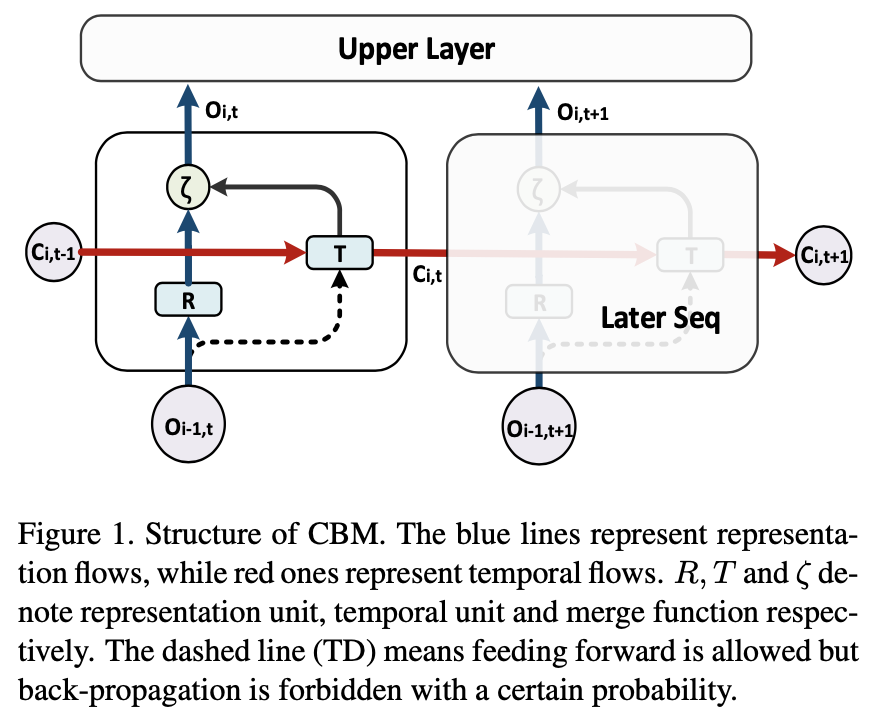
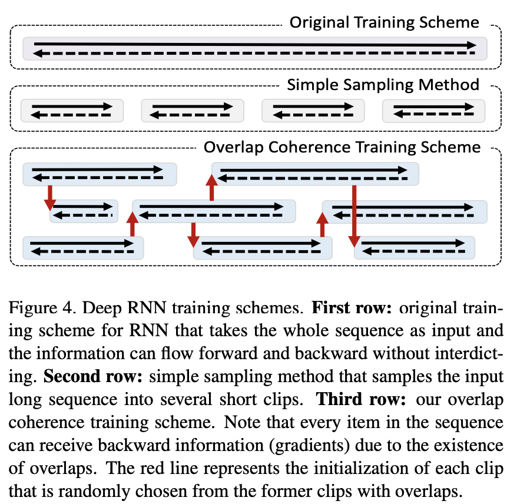
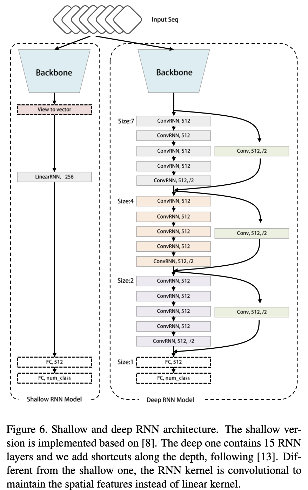
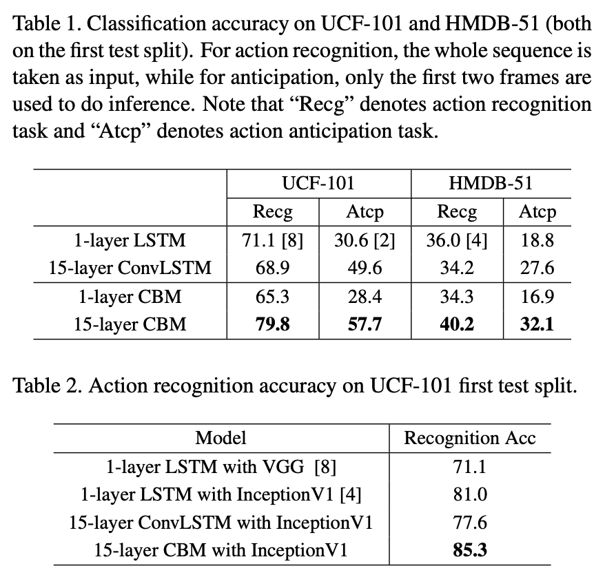
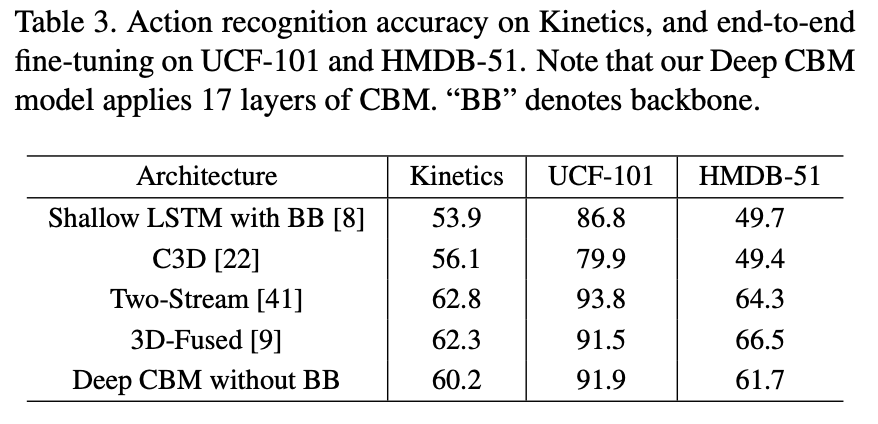
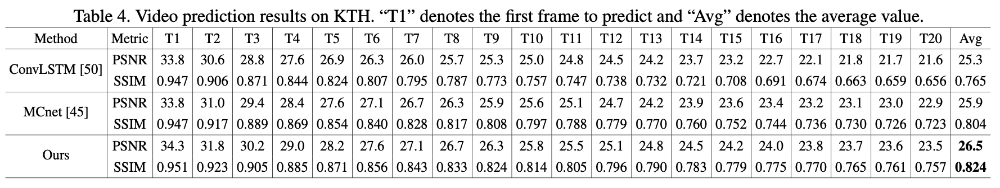

### 摘要

理解视频信息关键是要理解图像特征和时间序列，文中提出了一种新的深度递归神经网络，这种网络可以被深度叠加。主要的两个创新点是 *Context Bridge Module* 模块将序列（时序）和深度（空间表示）两种信息分开，从而更易于通过平衡两种数据进行深度训练；另一个是 *Overlap Coherence Training Scheme (重叠相干训练方式)*，使用这种训练方式降低视觉顺序任务训练的复杂度。

实验数据证明 CBM 便于优化，且随着深度的增加在许多视觉序列任务中可以获得不错的准确率。我们评估了具有15层深度的 CBM 框架，是传统RNN网络的7倍，但仍很容易训练。在Kinetics，UCF-101和HMDB-51视频分类中，相对于的低级RNN模型实现了11％的识别率。对于辅助注释，在将Polygon-RNN的浅RNN部分替换为我们的15层深CBM之后，性能提高了14.7％。对于视频的未来预测，我们的深度RNN在PSNR和SSIM上将最先进的浅层模型的性能提高了2.4％。

### 正文

视觉序列问题主要需要处理两种信息：*representation flow* 和 *temporal flow*。单纯增加 RNN 层数面临的问题：1. RNN 比如 LSTM、GRU更注重时序信息流的处理 2. 对于视觉任务处理的时间复杂度极高。

有大量的技术来解决视觉任务中的信息提取任务：

- Pooling：将序列视为一个集合，并提取图片中的数据，但对于时间特征的提取非常薄弱；
- 3D-CNN：用3维卷积核将时间维澄宇空间维，但3D卷积网络需要消耗大量的计算资源；
- RNN：用于处理序列问题，常常用来做一些视频分类、视频描述、辅助注视、视频未来预测等问题，但由于当前RNN较浅，性能也被限制了。

CBM 模型的好处就是更适合深度叠加，也更适合在普通计算机在进行训练。之前的RNN多是用来处理 NLP 领域的问题，在视觉任务中大部人都是在 CNN 中使用一些浅层 RNN 结构来提升性能。

使用计算单元（例如CNN结构）来提取单个输入样本的特征而无需重复操作，而时间流则采用RNN结构。如图1所示，在每个像元中都有一个“表示”单元R和一个“时间”单元T，它们分别充当单个输入样本上的代表特征提取器和顺序输入上的时间信息编码器分别。Representation 和 Teporal 单元合并在进行处理。

**Temporal Dropout**：以一定的概率丢弃一些神经元，从T单元通过图1中的虚线进行反向传播，这样可以减少两个流的复杂度并增强模型的泛化能力。

Comparison with RNN/LSTM：与常规RNN / LSTM的比较如前所述，堆叠式RNN / LSTM是深度循环架构的解决方案。实际上，我们提出的方法是它的通用版本。具体来说，当我们将R单元的输出设置为常数1时，我们的模型将退化为堆叠的RNN / LSTM模型（T单元可以是LSTM单元）。如果我们进一步将表示分支的深度设置为1，我们的模型将成为常规的浅RNN / LSTM。从另一个角度来看，我们的模型可以看作是具有额外上下文桥（即R单元）的堆叠RNN / LSTM的扩展。

**Overlap Coherence Training Scheme **

重叠相干训练方案由于存在重叠，序列中的每个项目都可以接收向后信息（渐变）。红线表示每个剪辑的初始化，这些剪辑是从以前的有重叠的剪辑中随机选择的。

将 l 阶马尔可夫过程简化为几个 n 阶（n <l）序列，通过引入重叠相干训练来平滑短片段之间的信息传播方案。在训练阶段，随机采样具有随机长度和起始点的片段，这自然会产生许多重叠（图4中的第三行）。重叠部分充当断开的剪辑之间的通信桥梁，以使信息在整个过程中顺畅地向前和向后流动。

模型结构及在几个数据集和不同的视觉序列任务中的实验结果测试如下：

15层 CBM 取得了最好的识别率。

### 总结

深入的RNN框架的第一部分是CBM结构，旨在平衡时序流和表示流。根据这两个流程的特点，使用 Temporal Dropout 以简化训练过程并增强泛化能力。第二部分是重叠相干训练方案，旨在解决深度RNN模型的大量资源消耗问题，该方案可以显着减少加载到模型中的序列的长度，并通过重叠同时保证时间信息的一致性。

我们进行了广泛的实验，以评估我们的深度RNN框架。与传统的浅层RNN相比，我们的深层RNN框架在动作识别，动作预期，辅助标注和视频未来预测任务方面实现了显着改进。进行了综合分析以进一步验证有效性 和特定设计的坚固性。 

-------

参考资料

- [马尔可夫模型](https://blog.csdn.net/qq_41686130/article/details/81906527)、[马尔可夫链](https://blog.csdn.net/fnqtyr45/article/details/81351364)
- 视频分类数据集[Kinetics-600](https://blog.csdn.net/liuxiao214/article/details/80144375)、[ucf-101](https://www.crcv.ucf.edu/data/UCF101.php)、[hmdb-51](http://serre-lab.clps.brown.edu/resource/hmdb-a-large-human-motion-database/)
- [论文源码](https://github. com/BoPang1996/Deep-RNN-Framework)

