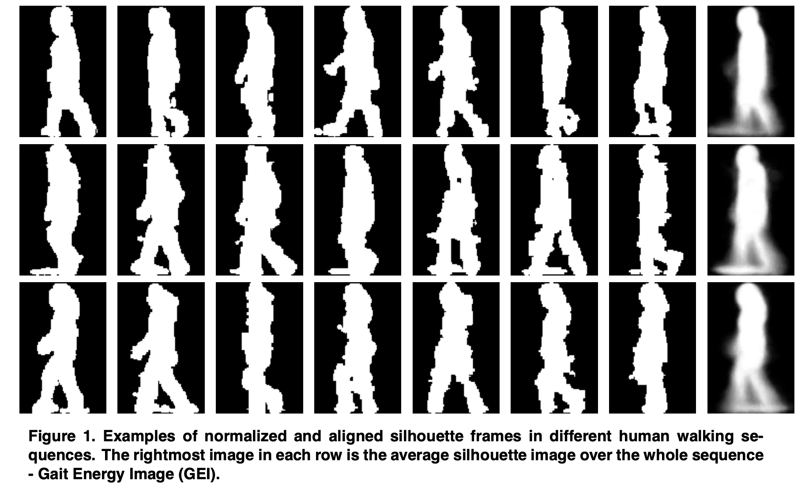

### [A Comprehensive Study on Cross-View Gait Based Human Identification with Deep CNNs [2017]](./2019-06-27-multimodal-feature-fusion-for-cnn-gait-recognition.md)

### The HumanID Gait Challenge Problem: Datasets, Performance, and Analysis [Feb. 2005]

#### 摘要

步态识别问题的“可解决”条件尚未得到理解或表征。为了提供一种测量进度和表征步态识别特性的方法，我们引入了HumanID步态挑战问题。挑战问题包括 Baseline 算法，一组12个实验和一个大数据集。Baseline 算法通过背景减法估算轮廓，并通过轮廓的时间相关性进行识别。这12个实验的难度越来越大，并检查了5个协变量对性能的影响。协变量分别是：视角变化（摄像头），鞋子类型变化，行走表面变化（在草地或水泥地），携带或不携带公文包以及比较序列之间经过的时间。 12个实验的识别率介于78％ 最简单的实验中，最困难的实验中只有3％。所有五个协变量均对性能有统计学上的显着影响，其中行走表面和时差的影响最大。该数据集由来自122个受试者的1,870个序列组成，涵盖五个协变量（1.2 GB数据）。步态数据，Baseline算法的源代码以及用于运行，评分和分析挑战实验的脚本可从http://www.GaitChallenge.org获得。该基础数据支持步态识别算法的进一步开发和其他实验，以了解新算法的优缺点。呈现的实验结果越详细，可能进行的分析就越详细，也就更便于我们理解。

#### 正文

本篇文章需要回答的几个问题：

- 在步态识别方面我们是否正在取得进展？
- 步态在多大程度上可以提供识别生物特征的潜力？
- 哪些因素影响步态识别？
  - 实验探究了五种相关因素对识别结果的影响，实验结果表明收集时间对识别率影响最大，行走地面第二，而其他三种因素也会影响部分实验结果但远没有收集时间对实验结果的影响大。
    - Surface: Grass / Concrete;
    - Camera View: Right / Left;
    - Shoe Type: A / B;
    - Briefcase: carry a BrifeCase / Not carry a Brifecase;
    - Acquisition time: May or November;
- 影响视觉步态识别的关键视觉成分是什么？
  - 根据正确识别对象的实验百分比，我们将数据集中的实验对象划分为容易，中等和难于识别的对象子集。
    - 如果受试者在超过80％的实验中被识别出，则很容易识别该受试者；在我们的数据集中有12个这样的受试者。
    - 我们认为很难在不到40％的实验中正确识别出该受试者；这个类别有56个受试者。
    - 其余中等程度难以识别。这个类别有54个受试者。
  - 从视觉上很难观察出为什么有些主体容易识别，为什么有些难以识别。在所有类别的受试者中都有不良的轮廓，例如缺少头部区域或腿部区域。衣服或阴影似乎也不起作用。但是，要在企业基础上排除其中的任何一项，将来必须进行深入的统计相关性研究。 
- 不同步态识别算法的优缺点是什么？

**数据集**：本文提供了一个比之前的研究大得多的数据集包括 122 个人的共 1870 个序列，样本的年龄、身高、体重分布如下图：

**实验**：本文中共进行十二个难度不同的实验，用不同的 probe 序列中的图进行识别，gallery 序列在每个实验中都是（草地，A型鞋，右视角，不携带包，五月/十一月收集），每个实验条件在表3中展示：

**Baseline 算法**：

1. *Locating the bounding boxes*: 以半自动方式在序列的每一帧中围绕移动的人定义边界框；
2. *Sihouette extraction*: 从边界框中提取轮廓；
   * 计算像素点均值和协方差，根据每个像素点和背景平均值的[马氏距离](https://baike.baidu.com/item/马氏距离/8927833?fr=aladdin)，之前的文章中通过设定阈值判断该点为背景或前景，本文通过使用迭代期望最大化（EM）程序估算前景和背景似然分布，从而适应地确定每帧的前景和背景标签。
3. *Gait peroid Detection*: 根据轮廓计算步态周期，步态周期用于划分子序列以进行时空相关计算;
   * 计算边界框中的前景像素点数目，当两腿分开到最大时，前景像素点最多，两腿重叠时前景像素点最少，取两个峰值为一个周期；
4. *Similarity Computation*: 计算两个步态序列之间的相似度。
   * 首先计算 probe 帧与 gallery 每一帧间的相似度；
   * 再根据相似度计算 probe 与 gallery 序列间的相关性；
   * 最后将 gallery 序列与这些 probe 子序列中每一个的最大相关性的中值作为相似度输出结果。

**实验结果分析**：首先测试了 baseline 算法在其他数据库上（CMU Mobo）的可行性，然后再进行本文设置的 12 个难度不同的实验，实验结果如下表所示。

最后对影响识别率的几个因素具体影响进行了实验并采用统计检验的方法进行计算。

#### 总结

HumanID步态挑战问题提供了一组12个难度不断增加的实验。 12个实验检查了摄像机角度，鞋子类型，草皮或混凝土表面，是否携带公文包以及时间五个协变量对性能的影响。识别性能从最简单的实验的78％降低到最困难的实验的3％。为了进行验证，在误报率为1％的情况下，性能从87％到6％不等。

### **Individual Recognition Using Gait Energy Image[2006]** 

#### 摘要

本文提出了一种新的时空步态表示形式，称为步态能量图像（GEI），以表征人的步行特性，从而通过步态进行个体识别。为了解决缺乏训练模板的问题，我们通过分析各种条件下的人体轮廓失真来生成一系列新的GEI模板。主成分分析后再进行多项判别分析，可用于从扩展的GEI培训模板中学习功能。根据学习到的功能进行识别。实验结果表明，所提出的GEI是一种有效且高效的步态表示方法，可用于个人识别，并且与当前的步态识别方法相比，该方法具有很高的竞争性能。

#### 正文

人类步行可以认为是循环重复的运动。在识别过程中，之前的研究要么匹配从特征序列中提取的统计信息，要么匹配两个序列中相应帧对之间的特征，相对于其周期长度进行了时间标准化。本文认为人类步行的差异主要在四肢的伸展以及躯干的形状，故不考虑时间序列，只在单个图像中生成时空模版用于识别。

使用GEI进行 7 个难度不同的实验，实验结果如下：

#### 结论

在本文中，提出了一种新的时空步态表示方法，称为步态能量图像（GEI），用于步态的个体识别。与其他将步态视为模板序列（姿势）的步态表示不同，GEI在保留时间信息的同时将人类运动序列表示在单个图像中。为了克服训练模板的局限性，我们通过分析各种条件下的人体轮廓失真来生成一系列新的GEI模板。主成分分析和多判别分析用于从扩展的GEI培训模板中学习功能。然后基于所学习的特征进行识别。实验结果表明：（a）GEI是一种有效且高效的步态表示形式，对单个帧中的偶然轮廓误差不敏感；（b）所提出的识别方法与已发表的步态识别方法相比，具有很高的竞争力。  

### Gait Recognition via Disentangled Representation Learning[2019]

- 传统步态识别根据轮廓或整体结构、关节来识别，但衣服、角度等变量会使识别率降低；
- 正面行走数据集 Frontal-View Gait datasets；
- 识别人的骨骼特征，明确区分姿势和外观特征；
- CNN+LSTM 网络；
- 在CASIA-B数据集的NM下识别准确性交叉视图。针对所有视角训练一个GaitNet模块，平均准确率 81.8%，达到了目前最高的性能结果。

### 

### Learning Effective Gait Features Using LSTM

步态能量图只能记录空间步态信息，丢失了时间序列上的关联性信息。为了解决这一问题，我们提出了一种新的特征学习方法用于步态识别。该特征不仅可以保存步态序列中的时间信息，而且可以应用于跨视图步态识别。利用基于卷积神经网络的姿态估计方法提取的热图，在一帧内描述步态信息。对于步态序列的建模，自然采用 LSTM 递归神经网络。LSTM 模型可以使用未标记数据进行训练，其中，受试者的身份在步态序列是未知的。当标签数据可用时，我们的LSTM作为一个帧到帧视图转换模型(VTM)。在步态基准上的实验证明了我们的方法的有效性。

