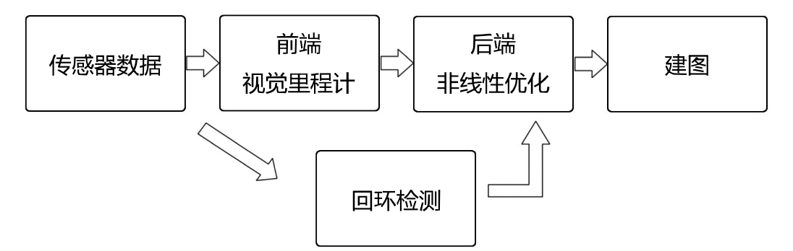
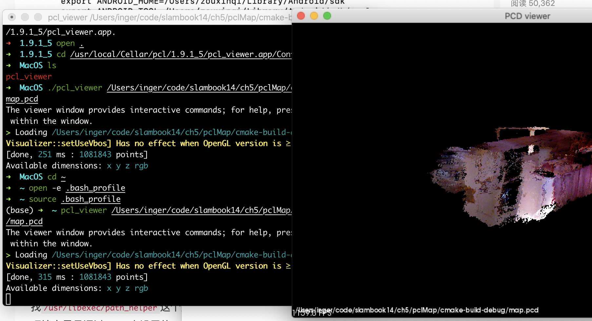

### Chapter 1, 2 - Introduction

**两类传感器**：

- 安装于环境中（比较简单），对外部提出了假设，限制了应用环境。
  - 外部的二维码定位：通过扫描二维码获取到位置信息；
  - GPS
  - 导轨、磁条
- 携带与机器人本体之上的，强调未知环境。
  - 激光：现阶段，激光建图研究方案已经比较清楚，价格较昂贵；
  - 相机：以一定速率采集图像，形成视频。方案不够可靠稳定，工作条件更苛刻（光线、遮挡、需要纹理）。成像时以二维投影记录三维世界信息，丢失了**距离**信息。
    - 单目 Monocular：必须通过**移动**相机产生深度；
    - 双目 Stereo：左右各有一个相机，通过**视差**计算深度；
    - 深度 RGBD：通过**物理方法**测量深度；量程较小，无法测量较远物体；
    - 其他：鱼眼, 全景, Event Camera, etc.

#### 视觉 SLAM 框架



- 传感器信息读取：视觉SLAM中主要为相机图像信息的读取和预处理；
- **视觉里程计**(Visual Odometry, VO)：**估算**相邻图像间相机的运动，以及局部地图的样子。
  - 不可避免有漂移（误差）
- **后端优化**(Optimization): 接受不同时刻视觉里程计测量的相机位姿，以及回环检测的信息，对它们进行优化，得到全局一致的轨迹和地图。
- **回环检测**（Loop Closing）:判断机器人是否曾经到达过先前的位置，如果检测到回环，将信息提供给后端进行处理。
- **建图**（Mapping）：根据估计的轨迹，建立与任务要求对应的地图。

#### SLAM 问题的数学描述

假设小萝卜携带着某种传感器在未知环境里运动。

- 离散时间：$$ t = 1,2,...,k$$
- 小萝卜的位置：$$ x_1, x_2, ... ,x_k $$
  - 将其看成随机变量，且服从一定的概率分布
  - 小萝卜是从上一个时刻运动到下一个时刻的
- **运动方程**：$$x_k = f(x_{k-1}, u_k, w_k) $$
  - $$u_k$$: 输入（运动传感器的读数）
  - $$w_k$$: 噪声
  - 用一般函数 f 来描述这个过程，而不具体指明 f 的作用方式，使得整个函数可以指代任意的运动传感器
- 路标（三维空间点）：$$y_1, y_2, ..., y_n$$
- **观测方程**：$$ z_{k,j} = h(y_j, x_k, v_{k,j}) $$
  - 当小萝卜在 $$x_k$$位置上看到了某个**路标**点 $$y_j$$，产生了一个观测数据$$z_{k,j}$$

当我们知道运动测量的读数 u，以及传感器的读数（观测并分析后的数据） z 时，如何求解定位 x 和建图问题 。

### Chapter 3 - 三维空间刚体运动

#### Eigen 库：矩阵运算

#### Pangolin: 三维显示

- 黑屏问题
  - 原因：依赖库安装错误，可能是找不到 glew 库文件
  - 根据 github 文档重新安装一遍

### Chapter 5 - 相机与图像

#### OpenCV的基本操作

#### PCL 拼接点云

1. PCL 的安装

   - `brew install pcl` 

2. pcl_viewer命令无效的解决办法

   - 在 brew 安装的所有文件目录下`/usr/local/Cellar/pcl/1.9.1_5`路径下有个pcl_viewer的.app文件，进入其包内，可以看到`pcl_viewer`的可执行程序；使用第二个命令行调用要展示的pcd文件。

   ```bash
   cd /usr/local/Cellar/pcl/1.9.1_5/pcl_viewer.app/Contents/MacOS
   
   ./pcl_viewer /Users/inger/code/slambook14/ch5/pclMap/cmake-build-debug/map.pcd
   ```

   - 添加环境变量，从而通过命令行调用 pcl_viewer 查看点云图像

```bash
open -e .bash_profile
```

添加一行：

```txt
export PATH=${PATH}:/usr/local/Cellar/pcl/1.9.1_5/pcl_viewer.app/Contents/MacOS
```

保存后关闭，输入命令行

```bash
source .bash_profile
```



最终效果如上图，在命令行直接输入 `pcl_viewer pcd文件路径`即可实现相应效果。