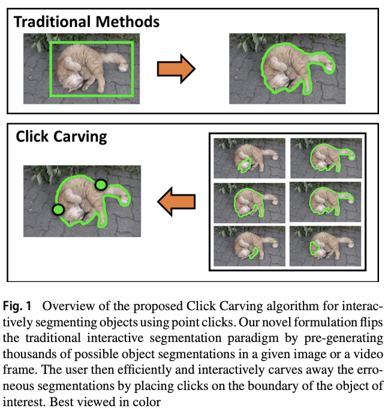

### 1. 基于常规网格数字高程模型的不确定度建模和表面积计算分析

- Uncertainty modeling and analysis of surface area calculation based on a regular grid digital elevation model
- INTERNATIONAL JOURNAL OF GEOGRAPHICAL INFORMATION SCIENCE (`SCI-3`)

在数字地形分析（Digital Terrain Analysis）领域，表面积计算（Surface Area Calculation）中不确定性的原理和方法尚未得到深入发展，需要进一步研究。本文考虑了DTA中数字高程模型（Digital Elevation Model）和SAC的数据源的不确定性，以进行以下调查：（a）截断误差（Truncation Error）建模和分析，（b）SAC传播误差的建模和分析（Propagation Error）通过使用蒙特卡洛模拟技术和空间自相关误差来模拟DEM不确定性。仿真实验表明：（a）在不引入DEM误差的情况下，较高的DEM分辨率和较低的地形复杂度将导致较小的TE和绝对误差（Absolute Error）； （b）随着DEM误差的引入，DEM分辨率和地形复杂性会影响SAC的AE和标准偏差（Standard Deviation），但两个值变化的趋势可能不一致； （c）引入的随机误差的空间分布 确定计算结果与表面积真实值之间偏差的大小和程度。这项研究提供了有关地理信息科学（Geographic Information Science）中SAC不确定性的原理和方法的见解，并为量化SAC不确定性提供了指导。 

### 2. 综述：从过滤和优化的角度回顾视觉惯性里程计

- SURVEY PAPER：A review of visual inertial odometry from filtering and optimisation perspectives
- Advanced Robotics (`SCI-4`)

视觉惯性里程计（VIO）是一种使用车载摄像头和IMU传感器的测量值来估计移动物体随时间变化的技术。近来，由于两个传感模块的尺寸小型化和价格低廉，VIO吸引了众多研究人员的广泛关注，并在各种潜在应用中获得普及。但是，考虑到准确性，实时性能，鲁棒性和操作规模，这对技术开发和工程实施都是非常具有挑战性的。这项调查旨在从基于过滤和优化的方法的角度报告最先进的VIO技术，这是研究领域采用的两种主导方法。为此，示出了3D刚体的各种表示。然后审查基于过滤的方法，然后再进行基于优化的方法。这些之间的联系 这两种方法将通过贝叶斯最大A后验的框架来阐明。还将讨论其他功能，例如可观察性和自校准。 

### 3. Click Carving：单击可在图像和视频中进行交互式对象分割 `IJCV-2019`

