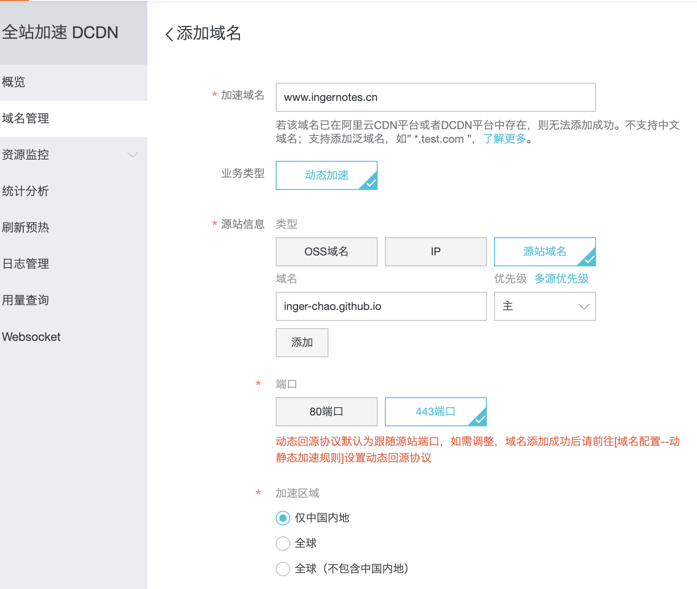
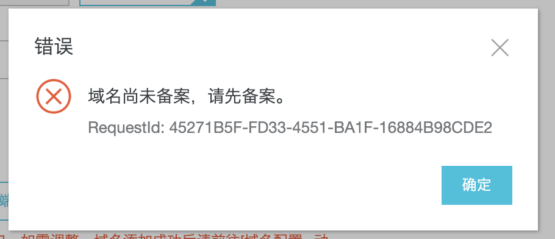

## 使用阿里云 CDN 优化 Git Page 国内访问速度

1. 域名备案。
   - 我在 GoDaddy 买的，之前并没有备案。结果忘记密码，上一部手机换号了，重置密码还需要发邮件取消验证，需要等待两天时间。
2. 购买阿里云 CDN 资源包。我买的是 500 GB一年（18块钱）;
3. 选择计费方式：由于个人博客对带宽的要求并不是很高，所以选择流量计费方式。

3. 阿里云 **CDN 域名管理面板**添加域名：
   - 加速域名：填自己买的并且备案了的域名（假如你要在国内加速的话😝）；
   - 业务类型：*视情况选择，一般默认；
   - 源站信息：推荐选源站域名，填上你的 Github Pages 域名（**注意**：不是你买的那个域名，也就是 `your username.github.io`）；
   - 端口：如果你的 Github Pages 开启了 Enforce HTTPS（强制HTTPS），那就选 443 端口，否则 80
   - 加速区域：视自己情况定，我选择是国内
4. 