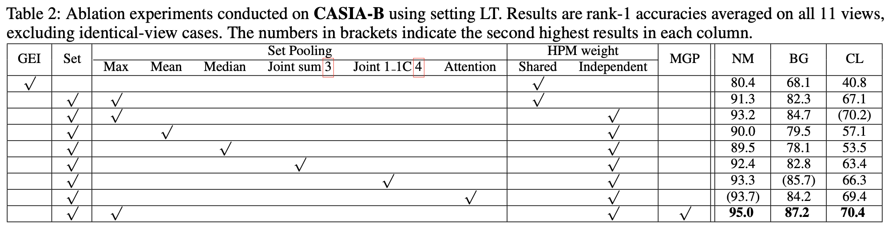

### [GaitSet](https://github.com/AbnerHqc/GaitSet)

#### Abstract

- 将步态序列视为步态集合，不关注步态序列中的时间关系，故其对输入的步态序列顺序性无任何要求，更关注空间上的步态特征。

- 提出了 GaitSet 网络用于步态识别任务；
  - CASIA-B
    - Normal Condition `95.0%`；
    - Bag-carrying: `87.2%`;
    - Coat-wearing: `70.4`;
  - OU-MVLP
    - Normal Condition: `87.1%`

#### Experments

##### 1. Comparison Between the Start-of-art methods and GaitSet

**CASIA-B**： 124 个人在 11 （0，18，……，180）个视角下 3 种条件（正常行走NM-6, 背包 BG-2, 大衣 CL-2）下的步态序列；既每个人含有 110 个不同特征的步态序列。

数据集不包含训练集和测试机的分割，所以将训练集分为三部分：

- Small-sample Training: 001 - 024 训练，025 - 124 测试；
- Medium-sample Training: 001- 062 训练，063 - 124 测试；
- Large-sample Training：001 - 074 训练，075 - 124 测试。

在测试集中 NM 前4个序列的图像作为 gallery set 照常用于训练，NM #5-6、BG #1-2、CL #1-2 作为 probe subsets 用于测试。

实验结果如表 1 所示，所有结果取的是除了测试视角外的 10 个 gallery 视角的平均值。比如，Probe 为36度的结果就是在 *Gallery NM#1-4 和其他每个视角*的训练条件下得出的模型验证 36 ° 视角步态序列的识别准确率的均值。除了 0° 和 180°，90°的实验结果总是最差的，可能是因为步态信息不仅包含步幅大小（在90°时最清晰），也包含手臂、身体的摆动（在 0° 和 180° 时最清晰）。平行透视图和垂直透视图都丢失了部分步态信息，36º 或 144º 等视图可以获取更多的信息。

**OU-MVLP**：目前最大的公开步态数据集。10307 个人在 14（0, 15, ... , 90; 180, 195, ... , 270）个视角下，每个视角包含 2 个序列。前5153 个人的序列用于训练，5154 用于测试。测试集中序列为 #01 的作为 gallery，序列为 #00 的作为 probe 用于测试。

在 OU-MVLP 的实验结果如下表所示，与 CASIA-B 类似，Probe X 的识别结果为 X 视角在 gallery 的其他视角下得到的训练模型的平均值。由于每个样品的表示只需要计算一次，GaitSet 可以在 8个NVIDIA 1080TI GPU的条件下，在7分钟内完成测试（包含133780个序列）。在 Probe 测试数据集中有些个体的步态序列是空的，下表的实验结果并不包含去掉空序列的值，如果删除 Gallery 数据集中的无关样本，平均识别准确率可以达到 `93.3%`。

##### 2. Ablation Experiments on CASIA-B

前两行表明使用 Set 比 GEI 步态能量图作为模型输入效果更好，主要原因在于1)  Set Pooling 操作基于 high-level feature map，更好的提取了 set-level feature，2) 将 gait 视为集合放大了训练集的噪声。

第 3 -8 行展示了不同 Set Pooling 参数对模型性能的影响。

第 2 行和第三行 展示了 HPM weight 对模型性能的影响。

##### 3. Practicality

- 当输入集只含有少量轮廓图像时，模型的性能如何？
-  不同角度的步态轮廓图像能否提高模型精度？
- 模型对于不同行走条件下的识别效果如何？

**步态图像数量**：

	1. 识别精度随着步态轮廓图数量的增加而单调增加；
 	2. 当样本包含25个以上的轮廓序列时，精度接近最佳性能。

**视角影响**

**行走条件影响**

----

